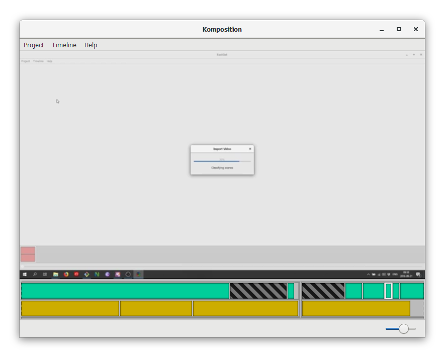
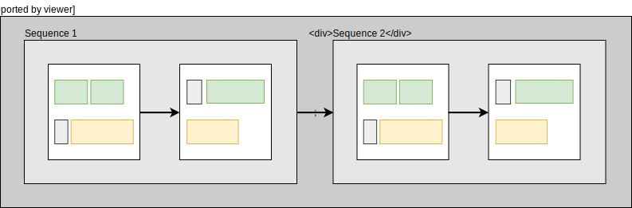

## About Me

- Live in Malmö, Sweden
- Work for [Symbiont](https://symbiont.io/)
- Blog at [wickstrom.tech](https://wickstrom.tech)
- Maintain some open source projects
- [Haskell at Work](https://haskell-at-work.com) screencasts
- Spent the last six months writing a screencast video editor

# Background{background=images/evolution.png .align-top .contain}

## Haskell at Work

- "Haskell at Work" screencasts
    - Centered around code editor
    - Fast-paced
    - No webcam overlay or effects
- My workflow
    - Write a detailed script
    - Record video separately
    - Record audio separately
    - Cut and join all "scenes"

## Video Editors

- Free video editors (Kdenlive, OpenShot, ...)
    - No good normalization and audio gate effects
    - Unsuited for my workflow
    - Written in C++
- Commerical video editors (Premiere Pro, Final Cut Pro, ...)
    - Proprietary
    - Expensive
    - Unsuited for my workflow

<aside class="notes">
* I first tried free video editors ...
* Then I tried proprietary video editors ...
* So, I started "The Great Yak Shave"
</aside>

# The Great Yak Shave{background=images/yak.jpg .dark .align-bottom}

## Building a Video Editor

- I decided to build a screencast video editor
    - Tailored to my workflow
    - Minimal, do one thing well
- I decided write it in Haskell
    - Didn't want to write an Electron app
    - Settled on GTK+
- Dog-fooding some of my own libraries

# Komposition{background=#00008B .dark}

## Komposition Overview

<table>
  <tr>
    <td>
- Cross-platform GUI application
- Modal
- Hierarchical timeline
    - Sequences
    - Parallels
    - Clips and gaps
- Automatic scene classification
- Automatic sentence classification
- Keyboard-driven editing workflow
    </td>
    <td width="50%">

    </td>
  </tr>
</table>

## Documentation

- [https://owickstrom.github.io/komposition/](https://owickstrom.github.io/komposition/)
    - User guide
    - Tutorial screencast

{width=60%}

## Keyboard-Driven Editing

<table>
  <tr>
    <td>
- Vim-like bindings
- Corresponding menu items
- Some mouse support
- Help dialog showing current mode's key bindings
    </td>
    <td width="50%">

    </td>
  </tr>
</table>

# Hierarchical Timeline{background=#dddddd}

## Clips

{width=80%}

<aside class="notes">
Clips are put in video and audio tracks within parallels
</aside>

## Video Still Frames

{width=80%}

<aside class="notes">
If the video track is shorter, it will be padded with still frames
</aside>

## Adding Gaps

{width=100%}

<aside class="notes">
- You can add explicit gaps in video and audio tracks
- These are also filled with still frames for video
</aside>

## Sequences

{width=100%}

<aside class="notes">
- Parallels are put in sequences
- Each parallel is played until its end, then the next, and so on
- Multiple parallels can be used to synchronize clips
</aside>

## Timeline

{width=100%}

<aside class="notes">
- The top level is the timeline
- The timeline contain sequences
- It's useful for organizing the parts of your screencast
</aside>

# Demo{background=#000000 background-video=images/demo.gif background-video-loop=true .dark}

# Implementation{background=images/cogs.jpg .dark}

## Striving for Purely Functional

- Pure functions and data structures in core domain
    - Timeline
    - Focus
    - Commands
    - Event handling
    - Key bindings
    - Parts of video classification
- Impure parts:
    - Audio and video import
    - Sentence classification
    - Preview frame rendering
    - Main application control flow

<aside class="notes">
- I'm striving to keep the core domain code pure
- "Functional core, imperative shell", Gary Bernhardt
- This includes: ...
- There are still impure parts, like: ...
</aside>

## GTK+

- Haskell bindings from `gi-gtk`
- Regular GTK+ was too painful
    - Imperative
    - Callback-oriented
    - Everything in IO, no explicit model
- Started `gi-gtk-declarative`
    - Declarative using data structures
    - VDOM-like diffing
    - Event handling based on pure functions and values
    - Custom widgets
- Imperative `gi-gtk` where needed

## Type-Indexed State Machines

- Using `motor` and `row-types` for typed state machines:

    ```haskell
    start
      :: Name n
      -> KeyMaps
      -> Actions m '[ n !+ State m WelcomeScreenMode] r ()
    ```

    ```haskell
    returnToTimeline
      :: ReturnsToTimeline mode
      => Name n
      -> TimelineModel
      -> Actions m '[ n := State m mode !--> State m TimelineMode] r ()
    ```
- Most complicated aspect of the codebase
- Currently being rewritten

<aside class="notes">
- I'm using a library I've been working on called "Motor" ...
- The most complicated aspect of the Komposition codebade
- Not sure if it's worth the complexity
    - But in combination with GADTs for state-specific events and commands ...
</aside>

## Singleton Pattern

```haskell
data Mode
  = WelcomeScreenMode
  | TimelineMode
  | LibraryMode
  | ImportMode

data SMode m where
  SWelcomeScreenMode :: SMode WelcomeScreenMode
  STimelineMode      :: SMode TimelineMode
  SLibraryMode       :: SMode LibraryMode
  SImportMode        :: SMode ImportMode
```

## Using Singletons

```haskell
data Command (mode :: Mode) where
  Cancel       :: Command mode
  Help         :: Command mode
  FocusCommand :: FocusCommand -> Command TimelineMode
  JumpFocus    :: Focus SequenceFocusType -> Command TimelineMode
  -- ...

keymaps :: SMode m -> KeyMap (Command m)
keymaps =
  \case
    SWelcomeScreenMode ->
      [ ([KeyChar 'q'], Mapping Cancel)
      , ([KeyEscape], Mapping Cancel)
      , ([KeyChar '?'], Mapping Help)
      ]
    -- ...
```

## Automatic Scene Classification

- Creates a producer of frames

    ```haskell
    readVideoFile :: MonadIO m => FilePath -> Producer (Timed Frame) m ()
    ```
- Custom algorithm for classification

    ```haskell
    classifyMovement
        :: Monad m
        => Time -- ^ Minimum segment duration
        -> Producer (Timed RGB8Frame) m ()
        -> Producer (Classified (Timed RGB8Frame)) m ()

    classifyMovingScenes ::
         Monad m
      => Duration -- ^ Full length of video
      -> Producer (Classified (Timed RGB8Frame)) m ()
      -> Producer ProgressUpdate m [TimeSpan]
    ```

## Automatic Sentence Classification

- Currently using `sox`
    - Normalization
    - Noise gate
    - Auto-splitting by silence
- Creates segment audio files on disk (can't extract timespans)

## Rendering

- Flattening timeline
    - Conversion from hierarchical timeline to a flat representation
    - Pads gaps and empty parts with still frames
- Flat representation is converted to a FFmpeg command
    - Data types for FFmpeg CLI syntax
    - Common flags
    - Filter graph

## Preview

- Proxy media for performance
- Same FFmpeg backend as when rendering
    - Output is a streaming HTTP server
    - Not ideal, would like to use a named pipe or domain socket
- GStreamer widget
    - Consumes the HTTP stream
    - Embedded in the GTK+ user interface
- Unreliable
- Currently doesn't work on individual clips and gaps

# Testing{background=images/testing.jpg .dark}

## Color-Tinting Video Classifier

- Tints the original video with red/green based on classification
- Easier to test classifier on real recordings


## Property-Based Testing

- Timeline commands and movement
    - Generates sequences of commands
    - Applies all commands
    - Resulting focus should always be valid
- Video scene classification
    - Generates known test scenes
    - Translates to real frame data
    - Runs classifier, compares to known test scenes
- Flattening of hierchical timeline
- Roundtrip properties of FFmpeg format printers and parsers

## Example-Based Testing

- Commands
- Navigation
- FFmpeg syntax printing

# Used Packages

## haskell-gi

- Bindings for GTK+, GStreamer, and more
    - gi-gobject
    - gi-glib
    - gi-gst
    - gi-gtk
    - gi-gdk
    - gi-gdkpixbuf
    - gi-pango
- Extended with gi-gtk-declarative

## massiv & massiv-io

- Used in video classifier
- Parallel comparison of pixel arrays
- No-copy conversion from JuicyPixels frames to massiv arrays
- Lower-resolution proxy media helps with performance

## Pipes

- Streaming frame reader and writer around `ffmpeg-light`
- IO operations with streaming progress notifications

    ```haskell
    importVideoFileAutoSplit
      :: (MonadIO m, MonadSafe m)
      => VideoSettings
      -> FilePath
      -> FilePath
      -> Producer ProgressUpdate m [VideoAsset]
    ```
- `pipes-safe` for handling resources
- `pipes-parse` for `StateT`-based transformations

## Others

- protolude
- lens
- typed-process

# Summary

## Retrospective

- The best parts
    - Building a useful tool
    - Haskell and GHC
    - Keeping core domain pure
    - Testing with Hedgehog
- The problematic parts
    - Video and audio codecs, containers, streaming
    - Executing external programs
    - GTK+ in Haskell
    - Dependency managment (non-Haskell dependencies)

## Next Steps

- Features
    - More commands (yank, paste, join, ...)
    - Preview any timeline part
    - Adjust clips
- Improvements
    - Technical debt, refactoring
    - Content-addressed project files (reuse, avoiding collision)
    - Optimized FFmpeg rendering
    - Optimized diffing (gi-gtk-declarative)
- Packaging (Debian, macOS, Windows, nixpkgs)
- ... and much more

## Thank You!

- Komposition: [owickstrom.github.io/komposition/](https://owickstrom.github.io/komposition/)
- Slides: [owickstrom.github.io/writing-a-screencast-video-editor-in-haskell/](https://owickstrom.github.io/writing-a-screencast-video-editor-in-haskell/)
- Image credits:
    - [Yak by travelwayoflife - Flickr, CC BY-SA 2.0](https://commons.wikimedia.org/w/index.php?curid=22106967)
    - [Human evolution scheme by M. Garde - Self work (Original by: José-Manuel Benitos), CC BY-SA 3.0](https://commons.wikimedia.org/w/index.php?curid=2165296)
    - [Old Cogs by Emmanuel Huybrechts from Laval, Canada (Old Cogs) CC BY 2.0, via Wikimedia Commons](https://commons.wikimedia.org/wiki/File:Old_Cogs_(5084228263).jpg)
    - [Save the skateboard!](https://www.reddit.com/r/BetterEveryLoop/comments/6gsbs3/save_the_skateboard/)
- Thanks to [\@sassela](https://twitter.com/sassela) for great feedback!
